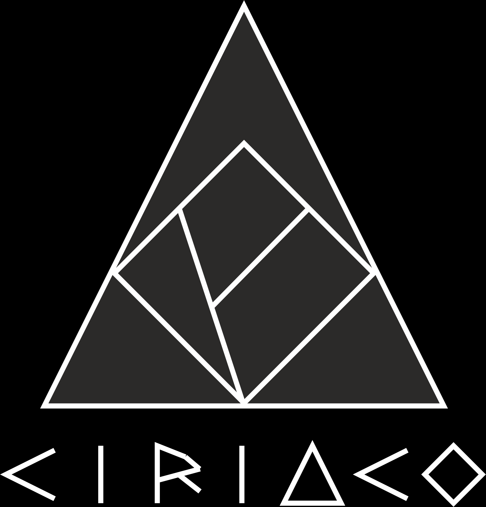

<p align="center">
  
</p>

<h1 align="center">CIRIACO</h1>

<p align="center">
  <strong>Conocimiento Integrado, Reutilizable, Indexado, Atómico, Colaborativo y Organizado</strong>
</p>

<p align="center">
  <em>Sistema basado en Grafos Aclíclicos Dirigidos (DAG) y Verificación Semántica Asistida por IA para la Representación, Trazabilidad y Reutilización del Conocimiento Científico</em>
</p>

<p align="center">
  <a href="https://unprg.edu.pe"></a>
  <a href="#dedicatoria"></a>
  <a href="#licencia--transferencia-tecnológica"></a>
</p>

---

## 🌹 Dedicatoria Especial / In Memoriam

> **En homenaje al Profesor Ciriaco De La Cruz**
> 
> *Este proyecto lleva con orgullo el nombre de mi amado padre, Ciriaco, un abnegado profesor de educación primaria quien dedicó su vida a sembrar con paciencia, amor y rigor la semilla de la curiosidad y el conocimiento en generaciones de niños.*
> 
> *Hoy, en el día de su cumpleaños, este trabajo científico rinde homenaje a su eterno legado. Su vocación educadora vive en la filosofía de CIRIACO: transformar la producción académica en un bien estructurado, reutilizable, transparente y accesible para la ciencia y la sociedad.*
> 
> **"La educación es el arte de hacer permanente la luz del conocimiento."**

---

## 📌 Descripción del Proyecto

**CIRIACO** es una plataforma científica y arquitectura de software desarrollada para el **Grupo de Investigación en Computación Distribuida e Inteligencia Artificial (GICDIAC)** de la Facultad de Ingeniería Civil, de Sistemas y Arquitectura (FICSA) en la **Universidad Nacional Pedro Ruiz Gallo (UNPRG)**.

El sistema resuelve la degradación del conocimiento universitario producida por la rotación de tesistas e investigadores, la fricción operativa en el formateo manual de manuscritos (IEEE / APA 7ma ed.) y las severas limitaciones de las arquitecturas tradicionales de recuperación por Inteligencia Artificial (*Naive Chunking* en archivos PDF).

```
                      [ DAG Engine: G = (V, E) ]
                                 │
         ┌───────────────────────┴───────────────────────┐
         ▼                                               ▼
 [ Atmo (Vértice) ]                             [ Arista PROV-O (E) ]
 - Unidad Atómica Inmutable                      - Dependencia Conceptual
 - Sellado SHA-256                               - Procedencia y Linaje
 - Tipado Semántico Estricto                     - Deriva Semántica (ΔS)
         │                                               │
         ├───────────────────────┬───────────────────────┤
         ▼                       ▼                       ▼
┌─────────────────┐     ┌─────────────────┐     ┌─────────────────┐
│ Editor WYSIWYM  │     │ Verificación    │     │  Atmo-Native    │
│  (Desacoplado)  │     │ Semántica por IA│     │   Graph-RAG     │
└─────────────────┘     └─────────────────┘     └─────────────────┘
```

---

## 🔬 Pilares Científicos y Arquitectura

### 1. Motor de Grafo Aclíclico Dirigido $G = (V, E)$
El Core Engine formaliza el discurso científico mediante un Grafo Aclíclico Dirigido $G = (V, E)$:
* **Vértices ($V$):** Objetos Atómicos de Conocimiento (`Atmo`) indivisibles e inmutables (Hipótesis, Metodología, Resultado, Conclusión, Dataset, Referencia).
* **Aristas ($E$):** Relaciones formales de procedencia y dependencia basadas en el estándar **W3C PROV-O** (*Lebo et al., 2013*).

### 2. Sellado Criptográfico SHA-256 e Inmutabilidad
Cada `Atmo` $v_i \in V$ se sella digitalmente al crearse garantizando la autoría inalterable:
$$\text{hash}(v_i) = \text{SHA-256}\Big(\text{content}(v_i) \parallel \text{type}(v_i) \parallel \text{author\_id}(v_i) \parallel \text{timestamp}(v_i) \parallel \sum_{v_k \in \text{Parents}(v_i)} \text{hash}(v_k)\Big)$$

### 3. Interfaz WYSIWYM con Desacoplamiento Tipográfico
Desacopla la edición semántica del contenido de la capa de visualización tipográfica, compilando dinámicamente en tiempo real hacia los estándares **IEEE** y **APA 7ma edición** (*Welch et al., 2019*).

### 4. Agentes de Verificación Semántica Estructurada
Módulos de Inteligencia Artificial que verifican la validez y consistencia entre pares de Atmos contiguos:
* **Hipótesis $\rightarrow$ Metodología:** Adecuación del diseño experimental.
* **Metodología $\rightarrow$ Resultado:** Reproducibilidad técnica de pasos.
* **Resultado $\rightarrow$ Conclusión:** Suficiencia empírica de datos.

### 5. Módulo Atmo-Native Graph-RAG
Recuperación contextual orientada a grafos que supera la fragmentación ciega de texto (*Naive Chunking*), exponiendo el conocimiento atómico verificado para sistemas de IA externos (*Edge et al., 2024*).

---

## 📊 Diseño Metodológico de la Tesis

* **Tipo de Investigación:** Aplicada-Tecnológica.
* **Diseño Experimental:** Preexperimental con preprueba y posprueba en un solo grupo ($O_1 \rightarrow X \rightarrow O_2$) (*Hernández-Sampieri et al., 2018*):
  $$G: O_1 \longrightarrow X \longrightarrow O_2$$
* **Población y Muestra:** 25 investigadores y tesistas activos del grupo de investigación **GICDIAC - UNPRG**.
* **Métricas Principales:** Tasa de Reutilización de Atmos ($F_R$), Índice de Cobertura de Trazabilidad ($I_{CT}$), Deriva Semántica ($\Delta S$) y Escala de Usabilidad SUS.

---

## 🏢 Licencia y Transferencia Tecnológica B2B

El proyecto CIRIACO promueve la **Innovación Abierta** y la articulación universidad-empresa (*CONCYTEC, 2022*):

* **Demostrador Público (`public_repo/`):** Código de vitrina, arquitectura, especificaciones y cliente web de presentación libre.
* **Core Engine Enterprise (Licenciamiento B2B):** El motor principal de la plataforma está disponible para implementación institucional e industrial mediante convenio de transferencia tecnológica con la **UNPRG / GICDIAC**.

Para solicitudes de licenciamiento empresarial, integración de APIs Graph-RAG o proyectos conjuntos de I+D+, contactar al equipo de investigación:

* **Autor / Investigador:** Bach. Alejandro De La Cruz (`adelacruzsu@unprg.edu.pe`)
* **Asesor de Investigación:** M.Sc. Juan Elías Villegas Cubas
* **Institución:** Universidad Nacional Pedro Ruiz Gallo — FICSA / GICDIAC
* **Ubicación:** Chiclayo, Lambayeque, Perú

---

## 📖 Referencias Académicas Destacadas

* **CONCYTEC.** (2022). *Diagnóstico de la Transferencia Tecnológica y la Producción Científica en las Universidades Públicas del Perú*. Lima, Perú.
* **Edge, D., et al.** (2024). From Local to Global: A Graph RAG Approach to Query-Focused Summarization. *arXiv preprint arXiv:2404.16130*.
* **Hernández-Sampieri, R., et al.** (2018). *Metodología de la Investigación* (6ta ed.). McGraw-Hill.
* **Lebo, T., et al.** (2013). *PROV-O: The PROV Ontology*. W3C Recommendation. World Wide Web Consortium.
* **Mons, B., et al.** (2011). The Value of Nanopublishing. *Nature Genetics*, *43*(4), 281-283.
* **Welch, L., et al.** (2019). Separation of Content and Presentation in Academic Publishing: A WYSIWYM Approach. *Proc. ACM CHI*, 401-412.

---

<p align="center">
  <sub>Desarrollado con orgullo y devoción académica en el GICDIAC - UNPRG | 2025</sub>
</p>
